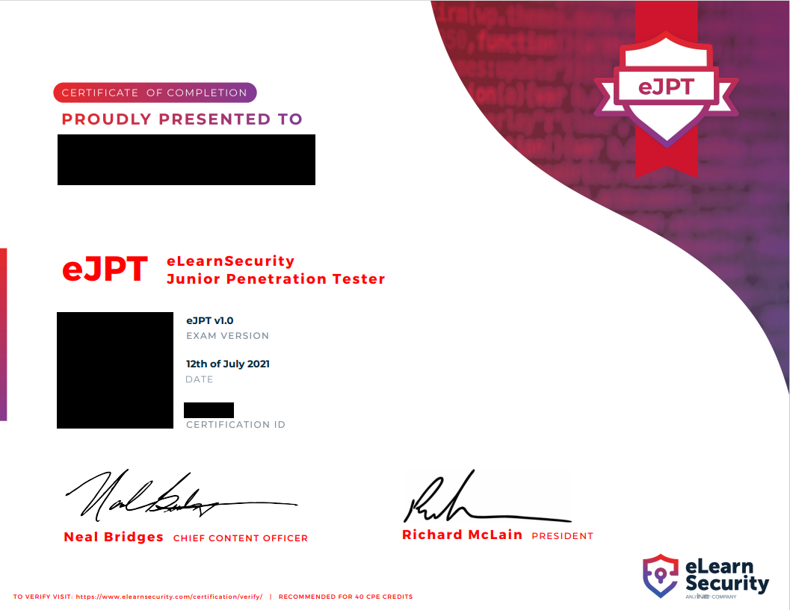

# eJPT Notes

## Introduction

This repository holds my notes for the eLearnSecurity Junior Penetration Tester certification.  While I would recommend you use these notes, I would also encourage you to make your own as you go through the INE [Penetration Testing Student](https://my.ine.com/CyberSecurity/learning-paths/a223968e-3a74-45ed-884d-2d16760b8bbd/penetration-testing-student) course.

For effective notetaking, I would highly recommend [Obsidian](https://obsidian.md/).  I have only started to use this recently and it has completely changed the way I write notes and ridiculously increased my productivity.

The notes that follow do not contain details about the labs or the exam for obvious reasons.  Also note that INE update their courses frequently so some of this information may be outdated.  I will do my best to update them, but I'm not planning on doing a complete overhaul should the course be significantly.

**Date last updated**: 6th January 2021

## Condensed Notes

Click [here](condensed_notes/README.md) for quick cheatsheet-style notes.

## Final Comments

I am very much a "quality of quantity" person, so the content I produce takes a long time for me to create.  If you like this or found it useful, buy me a coffee:

If you want to keep up to date on what I do, follow me here:

- [Twitter](https://twitter.com/0xV3R4X)
- [GitHub](https://github.com/0xv3r4x)
